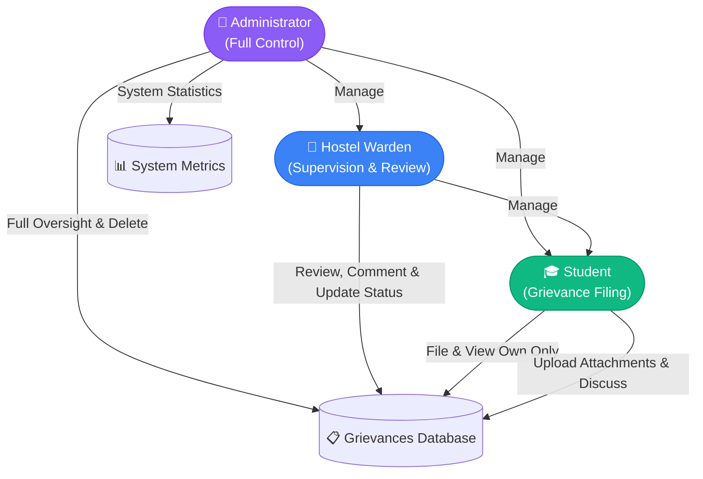

<div align="center">

# 🏛️ HostelGrievance
### *Next-Generation University Hostel Grievance Management System*

[](file:///d:/PROJECTS/Learnathon-5.0/src/server/app.test.ts)
[](file:///d:/PROJECTS/Learnathon-5.0/tsconfig.json)
[](https://svelte.dev)
[](https://hono.dev)
[](https://sqlite.org)
[](file:///d:/PROJECTS/Learnathon-5.0/SECURITY.md)

<p align="center">
  A secure, modern, role-driven university accommodation portal built with <b>Svelte 5</b>, <b>Tailwind CSS</b>, and a lightweight, hardened <b>Hono + SQLite</b> backend.
</p>

[✨ Key Features](#-features--role-portals) •
[🚀 Quick Start](#-quick-start) •
[🔐 Credentials](#-test-credentials) •
[🛡️ Security & RBAC](#-security--hierarchical-rbac) •
[📡 API Reference](#-api-architecture) •
[🧪 Testing](#-testing--verification)

---

</div>

## 🌟 Key Highlights

- 🔒 **Zero-Trust Role-Based Access Control (RBAC)**: Strict separation across **Admin**, **Warden**, and **Student** portals.
- ⚡ **Svelte 5 Runes Architecture**: Lightning-fast reactive state management, snappy transitions, and modern UI tokens.
- 🛡️ **Hardened Backend Security**: `bcrypt` key stretching, strict HTTP-only cookies, anti-IDOR checks, rate limiting, and MIME validation.
- 📂 **Multi-file Attachment Pipeline**: Safe handling, random file hashing, and path traversal protection.
- 📊 **Real-time Metrics & Dashboards**: Live complaint status tracking, student registry, room allocations, and audit logs.

---

## 👥 Features & Role Portals



### 👑 Administrator Portal (`/admin`)
- **System-Wide Dashboard**: Monitor real-time counts of open, in-progress, and resolved complaints alongside user distribution metrics.
- **User Management (`/admin/users`)**: Create, update, reset credentials, or remove Students, Wardens, and fellow Administrators.
- **Grievance Oversight (`/admin/grievances`)**: Comprehensive complaint search and filter, authority to modify status/details, and permanently delete records.

### 🏢 Warden Portal (`/warden`)
- **Triage & Review (`/warden/grievances`)**: Review submitted student issues, transition ticket statuses (*Open* ➔ *In Progress* ➔ *Resolved*), and post official notes.
- **Student Registry (`/warden/students`)**: Register new hostel residents, allocate/update room numbers, and manage resident profiles.
- **Access Boundary**: Wardens are strictly blocked from viewing or modifying warden or administrator accounts.

### 🎓 Student Portal (`/student`)
- **Complaint Lodging (`/student/grievances/new`)**: File categorized issues (*Maintenance, Water, Electricity, Internet, Cleanliness, Room, Other*) with optional image attachments.
- **Personal Tracker (`/student/grievances`)**: Track resolution progress in real time with interactive comment timelines.
- **Privacy Assurance**: Students can only access and view their own grievances (cryptographically and server-level enforced).

---

## 🚀 Quick Start

### 1. Installation

```bash
# Clone the repository
git clone https://github.com/Ayushman2005/Techie_Dominators_learnathon5.0.git
cd Techie_Dominators_learnathon5.0

# Install dependencies
npm install
```

### 2. Database Setup

Re-create and seed the SQLite database (`data/hostel.db`) with test accounts and sample grievances:

```bash
npm run db:reset
```

### 3. Launch Development Server

```bash
# Start frontend (Vite) and backend API (Hono) concurrently:
npm run dev:all
```

- 🌐 **Frontend Application**: [http://localhost:5173](http://localhost:5173)
- 🔌 **API Service**: [http://127.0.0.1:3001](http://127.0.0.1:3001)

---

## 🔐 Test Credentials

Use these seeded development accounts to test role workflows:

| Role | Email Address | Password | Permissions |
| :--- | :--- | :--- | :--- |
| **👑 Admin** | `admin@example.test` | `admin123` | Full access: Manage users, all grievances, system stats |
| **🏢 Warden** | `warden@example.test` | `warden123` | Triage grievances, manage student directory & rooms |
| **🎓 Student** | `student@example.test` | `student123` | File complaints, upload attachments, track own tickets |
| **🎓 Student** | `priya@example.test` | `student123` | Resident account (Room A-112) |
| **🎓 Student** | `rohan@example.test` | `student123` | Resident account (Room C-008) |

---

## 🛡️ Security & Hierarchical RBAC

The application implements a defense-in-depth security model to eliminate common web vulnerabilities:

```
┌─────────────────────────────────────────────────────────────┐
│                     Client Request                          │
└──────────────────────────────┬──────────────────────────────┘
                               │
                               ▼
┌─────────────────────────────────────────────────────────────┐
│ 1. CORS Allowlist & Secure Headers (CSP, Nosniff, Framing)  │
├─────────────────────────────────────────────────────────────┤
│ 2. Sliding Window Rate Limiting (Brute-Force Protection)    │
├─────────────────────────────────────────────────────────────┤
│ 3. HttpOnly Session Cookie Authentication                   │
├─────────────────────────────────────────────────────────────┤
│ 4. Hierarchical RBAC & Object-Level Authorization (No IDOR) │
├─────────────────────────────────────────────────────────────┤
│ 5. Parameterized SQL & Content Sanitization                 │
└──────────────────────────────┬──────────────────────────────┘
                               │
                               ▼
                   [ SQLite Database Engine ]
```

| Security Layer | Implementation Details |
| :--- | :--- |
| **Authentication** | Cryptographic session tokens stored in `HttpOnly`, `SameSite=Strict` cookies. Passwords hashed with `bcrypt` (10 rounds). |
| **BOLA / IDOR Defense** | Strict server-side ownership checks on all grievances, attachments, and user endpoints. |
| **Rate Limiting** | In-memory token bucket limiting login attempts (10 req/15min) and grievance submissions (5 req/min). |
| **File Safety** | Randomly generated UUID storage names, size capping (2MB), MIME-type verification, and forced attachment download disposition. |
| **Security Headers** | `X-Content-Type-Options: nosniff`, `X-Frame-Options: DENY`, `Referrer-Policy`, and strict `Content-Security-Policy`. |
| **Audit Logging** | Structured security events logged to `stdout` (logins, status changes, privilege checks, user mutations). |

---

## 📡 API Architecture

All endpoints are hosted under `/api` and require authenticated sessions (except login):

### Authentication
- `POST /api/login` — Sign in and receive session cookie (rate-limited).
- `POST /api/logout` — Invalidate session in DB and clear browser cookie.
- `GET /api/me` — Return active user profile.

### User Management *(Hierarchical RBAC)*
- `GET /api/users` — List users (Admins: all; Wardens: students only; Students: 403).
- `GET /api/users/stats` — Retrieve system user counts (Admin only).
- `POST /api/users` — Create user (Admin: any role; Warden: students only; Students: 403).
- `PATCH /api/users/:id` — Update user details or reset password.
- `DELETE /api/users/:id` — Remove user account (Admin: any except self; Warden: students only).

### Grievances & Attachments
- `GET /api/grievances` — Fetch grievances (Students: own only; Wardens & Admins: all).
- `POST /api/grievances` — Submit new grievance with multipart attachment support.
- `GET /api/grievances/:id` — Inspect grievance details, attachments, and comment thread.
- `PATCH /api/grievances/:id` — Update status (Wardens/Admins) or edit content (Owner Students/Admins).
- `DELETE /api/grievances/:id` — Delete grievance (Admin only).
- `POST /api/grievances/:id/comments` — Add comment to grievance discussion.
- `GET /api/attachments/:id` — Securely download verified attachment file.

---

## 🧪 Testing & Verification

Comprehensive automated test coverage with **Vitest**:

```bash
# Run complete test suite (56 security & workflow tests)
npm test

# Run TypeScript and Svelte syntax checks
npm run typecheck
```

### Test Suite Summary:
```
 ✓ src/server/app.test.ts (56 tests)
       ✓ Authentication & Session Cookies
       ✓ Anti-IDOR Grievance & Attachment Isolation
       ✓ Rate Limiting on Authentication & Filing
       ✓ Input Validation, Length Limits & SQL Safety
       ✓ Role-Based Authorization & Privilege Escalation Guards
       ✓ Admin, Warden & Student End-to-End Workflows

 Test Files  1 passed (1)
      Tests  56 passed (56)
```

---

## 📦 Project Structure

```text
├── src/
│   ├── lib/
│   │   ├── components/       # Svelte UI & App components (shadcn/ui based)
│   │   ├── services/         # Live API HTTP client & service contracts
│   │   ├── stores/           # Svelte 5 Runes auth session store
│   │   └── types.ts          # Universal domain types
│   ├── routes/
│   │   ├── admin/            # Admin dashboard, users & grievances management
│   │   ├── warden/           # Warden dashboard, student directory & triage
│   │   ├── student/          # Student dashboard & complaint filing
│   │   └── login/            # Secure sign-in portal
│   └── server/
│       ├── auth/             # Password hashing (bcrypt) & session management
│       ├── db/               # SQLite connection, schema, queries & seed scripts
│       ├── middleware/       # Rate limiting & security guards
│       ├── routes/           # REST routes (auth, users, grievances, attachments)
│       └── app.ts            # Hono application factory
├── HARDENING.md              # Security findings and remediation log
├── SECURITY.md               # Production security posture and audit report
├── THREAT-MODEL.md           # Formal threat model and STRIDE analysis
└── package.json
```

---

<div align="center">
  <sub>Built with ❤️ by <b>Techie Dominators</b> for Learnathon 5.0</sub>
</div>
