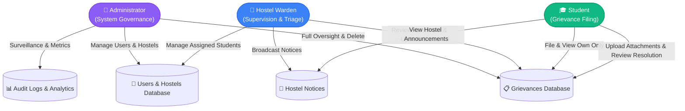

<div align="center">

# 🏛️ HostelGrievance
### *Next-Generation University Hostel Grievance Management System*

[](src/server/app.test.ts)
[](tsconfig.json)
[](https://svelte.dev)
[](https://hono.dev)
[](https://sqlite.org)
[](SECURITY.md)

<p align="center">
  A secure, modern, role-driven university accommodation portal built with <b>Svelte 5</b>, <b>Tailwind CSS</b>, and a lightweight, hardened <b>Hono + SQLite</b> backend.
</p>

[✨ Key Features](#-features--role-portals) •
[🚀 Quick Start](#-quick-start) •
[🔐 Test Credentials](#-test-credentials) •
[🛡️ Security Architecture](#-security--hierarchical-rbac) •
[📡 API Reference](#-api-architecture) •
[🧪 Testing & Verification](#-testing--verification) •
[📑 Documentation](#-documentation-index)

---

</div>

## 👥 Team — Techie Dominators

> Submitted for **Learnathon 5.0** — Web Application Security & Hardening Track

| # | Name | Role |
|---|------|------|
| 1 | **Ayushman Kar** | Lead Developer |
| 2 | **Kaushik Mohanty** | Frontend & UI |
| 3 | **Ayush Raj** | Backend & Security |

---

## 🌟 Key Highlights

- 🔒 **Zero-Trust Role-Based Access Control (RBAC)**: Strict server-side separation across **Admin**, **Warden**, and **Student** portals.
- ⚡ **Svelte 5 Runes Architecture**: Lightning-fast reactive state management, snappy transitions, and modern accessible UI tokens.
- 🛡️ **Hardened Backend Security**: `bcrypt` password hashing, SHA-256 hashed session tokens, Double-Submit CSRF protection, anti-IDOR checks, rate limiting, and byte-level magic signature validation.
- 📂 **Multi-file Attachment Pipeline**: Safe handling, server-generated UUID storage names, path traversal prevention, and automatic disk cleanup on record deletion.
- ⭐ **Resolution Reviews & Verification**: Students can rate resolved grievances (1–5★) and attach photographic proof of resolution.
- 📢 **Hostel Broadcast Notices**: Targeted announcements per hostel block or institution-wide.
- 🏢 **Multi-Hostel Administration**: Manage hostel buildings and assign wardens and students to specific hostel blocks.
- 📊 **Real-time Analytics & Audit Surveillance**: Live complaint tracking, SLA monitoring, and comprehensive audit logs with formula-safe CSV export.

---

## 👥 Features & Role Portals



### 👑 Administrator Portal (`/admin`)
- **System-Wide Dashboard**: Monitor real-time counts of open, in-progress, and resolved complaints alongside user distribution metrics.
- **User Management (`/admin/users`)**: Create, update, reassign wardens, reset credentials, or remove Students, Wardens, and Administrators.
- **Hostel Management (`/admin/hostels`)**: Create and manage hostel blocks and facilities.
- **Grievance Oversight (`/admin/grievances`)**: Comprehensive complaint search and filter, authority to modify status/details, and permanently delete records.
- **Analytics & SLA Monitoring (`/admin/analytics`)**: View average resolution times, overdue metrics, monthly complaint volume, and per-warden performance.
- **Audit Surveillance (`/admin/audit-logs`)**: Search, filter, inspect, and export tamper-evident audit logs with formula injection sanitization.

### 🏢 Warden Portal (`/warden`)
- **Triage & Review (`/warden/grievances`)**: Review submitted student issues, transition ticket statuses (*Open* ➔ *In Progress* ➔ *Resolved*), and post official response comments.
- **Student Registry (`/warden/students`)**: Register new hostel residents, allocate/update room numbers, and manage resident profiles assigned to their care.
- **Hostel Notice Board (`/warden/notices`)**: Broadcast targeted announcements to students in their assigned hostel block.
- **Access Boundary**: Wardens are strictly blocked from viewing or modifying warden or administrator accounts.

### 🎓 Student Portal (`/student`)
- **Complaint Lodging (`/student/grievances/new`)**: File categorized issues (*Maintenance, Water, Electricity, Internet, Cleanliness, Room, Other*) with priority levels, convenient contact times, and optional image/PDF attachments.
- **Personal Tracker (`/student/grievances`)**: Track resolution progress in real time with interactive comment timelines and status transition history.
- **Resolution Review (`/student/grievances/:id`)**: Rate completed solutions (1 to 5 stars), submit detailed feedback, and upload photographic proof of resolution.
- **Notice Board (`/student/notices`)**: Read official announcements posted by wardens and administrators.
- **Self-Service Profile (`/student/profile`)**: Update emergency contacts, phone numbers, and securely change account password.
- **Privacy Assurance**: Students can only access and view their own grievances (server-side enforced).

---

## 🚀 Quick Start

### 1. Prerequisites
- **Node.js**: `v20.x` or higher
- **npm**: `v10.x` or higher

### 2. Installation

```bash
# Clone the repository
git clone https://github.com/Ayushman2005/Techie_Dominators_learnathon5.0.git
cd Techie_Dominators_learnathon5.0

# Install dependencies
npm install
```

### 3. Database Initialization

Re-create and seed the SQLite database (`data/hostel.db`) with test accounts and sample grievances:

```bash
npm run db:reset
```

### 4. Launch Development Server

```bash
# Start frontend (Vite) and backend API (Hono) concurrently:
npm run dev:all
```

- 🌐 **Frontend Application**: [http://localhost:5173](http://localhost:5173)
- 🔌 **Backend API Service**: [http://127.0.0.1:3001](http://127.0.0.1:3001)

---

## 🔐 Test Credentials

Use these seeded development accounts to test role workflows:

| Role | Email Address | Password | Identifiers | Permissions & Scope |
| :--- | :--- | :--- | :--- | :--- |
| **👑 Admin** | `admin@example.test` | `admin123` | Emp ID: `EMP-ADM01` | Full access: Users, hostels, grievances, analytics, audit logs |
| **🏢 Warden** | `warden@example.test` | `warden123` | Emp ID: `EMP-WAR01` | Triage grievances, manage assigned student directory & notices |
| **🎓 Student** | `student@example.test` | `student123` | Roll: `24BCE1001` (Room B-204) | File complaints, upload attachments, submit resolution reviews |
| **🎓 Student** | `priya@example.test` | `student123` | Roll: `24BCE1002` (Room A-112) | Resident account assigned to Warden |
| **🎓 Student** | `rohan@example.test` | `student123` | Roll: `24BCE1003` (Room C-008) | Resident account assigned to Warden |

---

## 🛡️ Security & Hierarchical RBAC

The application implements a defense-in-depth security architecture:

```
┌─────────────────────────────────────────────────────────────┐
│                     Client Request                          │
└──────────────────────────────┬──────────────────────────────┘
                               │
                               ▼
┌─────────────────────────────────────────────────────────────┐
│ 1. CORS Allowlist & Secure Headers (CSP, Nosniff, Framing)  │
├─────────────────────────────────────────────────────────────┤
│ 2. Global Body Size Limit Guard (10 MB Max Body)            │
├─────────────────────────────────────────────────────────────┤
│ 3. Double-Submit CSRF Protection (X-CSRF-Token)             │
├─────────────────────────────────────────────────────────────┤
│ 4. Sliding Window Rate Limiting (Brute-Force & DoS Guard)   │
├─────────────────────────────────────────────────────────────┤
│ 5. HttpOnly, SameSite=Strict Session Cookie Authentication  │
├─────────────────────────────────────────────────────────────┤
│ 6. Hierarchical RBAC & Object-Level Authorization (No IDOR) │
├─────────────────────────────────────────────────────────────┤
│ 7. Byte-Level Magic Signature Verification for File Uploads │
├─────────────────────────────────────────────────────────────┤
│ 8. Parameterized SQL & Content Sanitization                 │
└──────────────────────────────┬──────────────────────────────┘
                               │
                               ▼
                   [ SQLite Database Engine ]
```

| Security Control | Implementation Details |
| :--- | :--- |
| **Authentication** | Cryptographic 256-bit session tokens stored as SHA-256 hashes in SQLite; cookies configured with `HttpOnly`, `SameSite=Strict`, and `Secure` (in prod). Passwords hashed with salted `bcrypt` (10 rounds). |
| **CSRF Defense** | Double-Submit Cookie verification with `csrf_token` cookie and `X-CSRF-Token` HTTP header on all mutating requests. |
| **BOLA / IDOR Defense** | Strict server-side ownership checks (`assertCanViewGrievance`) on all grievances, attachments, comments, and reviews. |
| **Rate Limiting** | Sliding window rate limiting on authentication (10 req/min), grievance creation, and comment posting. |
| **File Safety** | Randomly generated UUID storage names, 5 MB size cap, byte-level magic signature validation (JPEG, PNG, GIF, WebP, PDF), and forced attachment download disposition. |
| **Data Integrity & Cleanup** | `ON DELETE CASCADE` foreign keys and `deleteStoredFile` disk cleanup to prevent orphaned files. |
| **Security Headers** | `X-Content-Type-Options: nosniff`, `X-Frame-Options: DENY`, `Referrer-Policy: strict-origin-when-cross-origin`, and strict `Content-Security-Policy`. |
| **Audit Surveillance** | Structured security events logged to SQLite `audit_logs` table and `stdout` with formula injection prevention on CSV export. |

---

## 📡 API Architecture

All backend routes are hosted under `/api` and require authenticated sessions (except login and health check):

### Authentication (`/api`)
- `POST /api/login` — Sign in and receive session cookie (rate-limited).
- `POST /api/logout` — Invalidate session in DB and clear browser cookie.
- `GET /api/me` — Return active user profile.

### User Management (`/api/users`)
- `GET /api/users` — List users (Admins: all; Wardens: assigned students only; Students: 403).
- `GET /api/users/stats` — Retrieve system user counts (Admin only).
- `GET /api/users/wardens` — List all wardens for student assignment (Staff & Admin only).
- `POST /api/users` — Create user (Admin: any role; Warden: students only; Students: 403).
- `PATCH /api/users/:id` — Update user details or reassign warden.
- `DELETE /api/users/:id` — Remove user account and cascade delete files.
- `PUT /api/users/me` — Self-service update for phone and emergency contact.
- `POST /api/users/me/change-password` — Self-service password change with verification.

### Grievances & Attachments (`/api/grievances`, `/api/attachments`)
- `GET /api/grievances` — Fetch filtered, paginated grievances scoped by role.
- `GET /api/grievances/stats` — Summary statistics scoped to user's role.
- `GET /api/grievances/analytics` — Detailed resolution analytics and SLA metrics (Admin only).
- `POST /api/grievances` — Submit new grievance with multipart attachment support.
- `GET /api/grievances/:id` — Inspect grievance details, attachments, and comments.
- `PATCH /api/grievances/:id` — Update status (Wardens/Admins) or edit content (Owner Students/Admins).
- `DELETE /api/grievances/:id` — Permanently delete grievance and physical attachments (Admin only).
- `GET /api/grievances/:id/comments` — List comment discussion thread.
- `POST /api/grievances/:id/comments` — Add comment to discussion thread.
- `POST /api/grievances/:id/attachments` — Upload additional attachment to open grievance.
- `POST /api/grievances/:id/review` — Submit 1–5★ rating, feedback, and solution photo.
- `GET /api/grievances/:id/history` — Inspect status transition history log.
- `GET /api/attachments/:id` — Securely download verified attachment file.

### Notices & Announcements (`/api/notices`)
- `GET /api/notices` — List notices relevant to the user (global + assigned hostel).
- `POST /api/notices` — Broadcast new notice (Wardens: assigned hostel; Admins: any).
- `DELETE /api/notices/:id` — Remove notice (Author or Admin).

### Hostel Management (`/api/hostels`)
- `GET /api/hostels` — List all hostel buildings.
- `POST /api/hostels` — Create new hostel building (Admin only).
- `DELETE /api/hostels/:id` — Remove hostel building (Admin only).

### Audit Logs (`/api/audit-logs`)
- `GET /api/audit-logs` — Paginated, filtered audit log surveillance (Admin only).
- `GET /api/audit-logs/stats` — Aggregated event statistics (Admin only).
- `GET /api/audit-logs/export` — Export audit logs to JSON or formula-sanitized CSV (Admin only).

---

## 🧪 Testing & Verification

Comprehensive automated test coverage with **Vitest**:

```bash
# Run complete test suite (85 security & workflow tests)
npm test

# Run TypeScript and Svelte compilation checks
npm run typecheck
```

### Test Suite Summary:
```text
 ✓ src/server/app.test.ts (85 tests)
       ✓ Authentication, Password Hashing & Session Invalidation
       ✓ Anti-IDOR Grievance, Comment & Attachment Isolation
       ✓ Rate Limiting on Authentication & Filing
       ✓ Input Validation, Length Limits & SQL Safety
       ✓ Role-Based Authorization & Privilege Escalation Guards
       ✓ Post-Resolution Review & Star Rating Verification
       ✓ Student-Warden 1-to-1 Mapping & Employee/Roll ID Uniqueness
       ✓ Audit Logging Surveillance & CSV Formula Sanitization
       ✓ Automatic Disk Storage Cleanup on Record Deletion

 Test Files  1 passed (1)
      Tests  85 passed (85)
```

---

## 📦 Project Structure

```text
├── src/
│   ├── lib/
│   │   ├── components/       # Svelte UI components (shadcn/ui based)
│   │   ├── services/         # Live API HTTP client & service contracts
│   │   ├── stores/           # Svelte 5 Runes auth session store
│   │   └── types.ts          # Universal domain types
│   ├── routes/
│   │   ├── admin/            # Admin dashboard, users, grievances, hostels, notices & audit logs
│   │   ├── warden/           # Warden dashboard, student directory, triage & notices
│   │   ├── student/          # Student dashboard, complaint filing, reviews & profile
│   │   └── login/            # Secure sign-in portal
│   └── server/
│       ├── auth/             # Password hashing (bcrypt) & session management
│       ├── db/               # SQLite connection, schema, queries & seed scripts
│       ├── middleware/       # Rate limiting & CSRF double-submit protection
│       ├── routes/           # REST routes (auth, users, grievances, attachments, audit, notices, hostels)
│       └── app.ts            # Hono application factory
├── HARDENING.md              # Security findings register (F-01 to F-27)
├── SECURITY.md               # Production security posture and audit report
├── THREAT-MODEL.md           # Formal threat model and STRIDE analysis
├── SUBMISSION.md             # Project evaluation and verification guide
└── package.json
```

---

## 📑 Documentation Index

- 🛡️ **[SECURITY.md](SECURITY.md)** — Production security posture, cryptographic standards, and authentication architecture.
- 📐 **[THREAT-MODEL.md](THREAT-MODEL.md)** — Comprehensive threat model, STRIDE threat analysis, and blast-radius assessment.
- 🔨 **[HARDENING.md](HARDENING.md)** — Security hardening register detailing findings F-01 through F-27.
- 📋 **[SUBMISSION.md](SUBMISSION.md)** — Submission checklist, execution commands, and review guide.

---

<div align="center">
  <sub>Built with ❤️ by <b>Techie Dominators</b> for Learnathon 5.0</sub>
</div>
